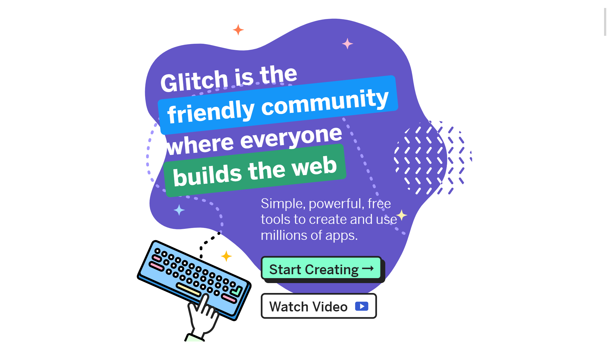
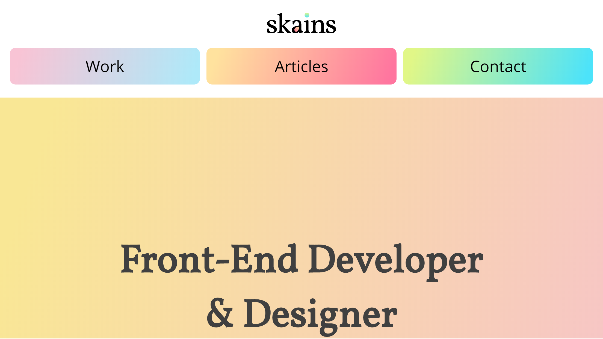
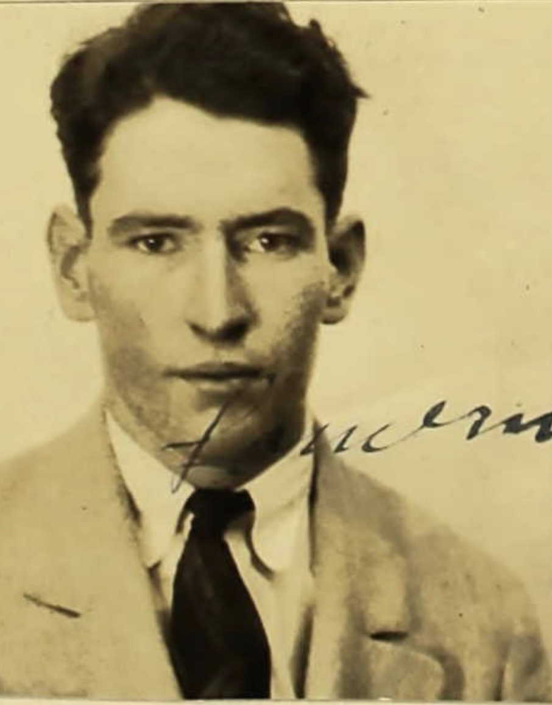

## Introduction

Like everyone, my 2010s have had their ups and downs, but the last few years have left me feeling like my authentic self has not been shining as brightly as I would like.
To help with this, I have decided to re-brand myself for the 2020s.

My new "look-and-feel" has not been picked on an arbitrary basis. I've arrived here after an earnest effort to understand what aspects of other people I admire most, and what things irritate me to no end. While these findings definitely can't be the entirety of my re-brand, they can serve as a base to build upon. I may have taken some of these things too far in some regards.

With all of that in mind, here are a few of my key takeaways from my casual observations...

Things I ***like*** about other people:
- Lots of fun and color
- Openly sharing thoughts and opinions in a non-confrontational way
- Standing up for themselves and others when the stakes are small or large
- Not being afraid to change their opinion or preference after a new experience or receiving new information

Things I ***dislike*** about other people:
- Being hard-headed on things that don't matter
- Judging others for things that don't impact them (a person's career, pronouns, clothing, general appearance, artistic preferences, etc.)
- Not valuing the perspectives and experiences of others

You would be correct in stating that the above traits are *very broad* and apply to large portions of the population.

More often than not, the traits in my **dislike** list somehow appear in many managers, CEOs, supervisors, or general thought-leaders.

Elon Musk pops into my heads as a very popular person that matches nearly all of my dislikes.

The people who embody my **likes** list are the ones who feel authentic in their speech and actions. Frequently, I find these to be individuals that work in a small office setting, work as a freelancer, or work in an environment that encourages them to be who they truly are.

To compare apples to apples, Elon Musk's counter-CEO would be [Anil Dash](https://anildash.com/) (eight-letter names and everything). Anil Dash is the CEO of [Glitch](https://glitch.com/), a company that, in my naive opinion, is the pinnacle of ethics and openness in the tech community. I highly recommend you have a look at [Anil's Twitter](https://twitter.com/anildash) to see for yourself his thoughts and opinions!

While I look at the lists above, I see some of myself in both the likes and dislikes. I **don't do** the things I like enough and I **do** the things I dislike too much. My re-branding for 2020 is meant to tackle that disparity in myself.

## Using What I Found

Knowing the core principles of what I like and dislike made it somewhat easier for me to decide how I wanted to change myself and my "brand" in 2020.

The easiest and simplest of these changes are at the surface-level. If I want to incorporate more fun and color, then I should do that! My website now has been filled with an amount of color that I find visually pleasing, and I intend to fill the rest of my life with more color and fun experiences.

I have been too preoccupied with appearing mature or serious and I haven't let myself relax as much I should.

Some other modifications will take significantly more effort to see through. I've recently gotten back into [Twitter](https://twitter.com/riley_skains) so that I can share my more inner thoughts with a relatively indifferent audience. Doing more than that in my daily life will take genuine commitment and serious changes to how I interact with other people in nearly every setting.

The alterations I am most excited about will take the largest amount of my time and energy by a large margin. Interpreting all of my listed items at their surface-level presents me with simple changes, but more holistic changes are also possible! What if I could change my entire circumstance to overhaul how I view the world and my situation?

## Looking Deeper

To get semi-off-topic (but not really!) - I have spent significant time and effort looking at my family history,  and have found things that both delight and disappoint me. There have been many great people that made me swell with pride and many others that forced me to close my laptop in disgust.

Even more so, there were others where I could find almost nothing about them. I don't know what they did or where they lived for half of their lives. Some of them I don't even know who their parents were or the name of their spouse. There have even been a few instances where I don't know *their* names.

While being completely forgotten is not something I fear in general - it's probably not possible in this age of information - I want to leave something behind when I die. Some kind of legacy. And I would prefer it to be a positive one.

It doesn't have to be something big. It doesn't need to be a huge family home that can be passed down for generations or a monumental trust fund that sets my family up financially for the rest of their lives. While those would be great things, I can happily live with something smaller.

As an example, on my mother's side, there are constant memories of my great-grandfather, my 2nd great-grandfather, and my 3rd great-grandfather. All of them were blacksmiths, and there are pieces on the family fireplace from their occupations. An anvil, something from a railroad, a kitchen trivet, or a piece of metal from some shipping light can start a conversation and trigger a memory. They are small and nearly worthless things, but they mean a lot.

Moreover, being a blacksmith was a skill they possessed, mastered, and was valuable at the time. It wasn't exceedingly rare or strange to be a blacksmith - it was pretty common in that time and in that area. They just made the best of it!

That is what I want to do too. I don't need fame or glory. I just want to be relatively good at the thing I enjoy doing and be pretty un-problematic by the future's standards.

## My Actual Plans

I have had the desire to get into freelancing. I want to experience what it's like to work within my skillset on projects that I can moderate while making decisions that impact only myself, the client, and the users - a far cry from my current public sector job where everything is done by committee.

2020 will be the first year that I pursue this with true intent. I'm not going to be quitting my job or reducing my hours or anything of that nature, but I will be making this my "side gig".

It's not my goal to become rich off of this little exploration into freelancing, it's more to get a sense of fulfillment from being my own boss in some of my professional endeavors. I'm positive that I will get a lot of interesting insight over the year, so I will be sure and post more on my experiences!

## Wrapping Up

I debated whether a "re-brand" describes what I am doing here, but I didn't like any of the alternatives that I came up with. After all, I am still the same Riley as I was in 2019, I am just going to think and present myself a little differently.

Apple before and after the iPod may seem like completely different companies, but they are still the same entity, right? That's what I'm trying to do here.

Whether I'll be completely successful in my first year is not of great consequence, but I do want to learn a lot and experience the world from within my new brand.